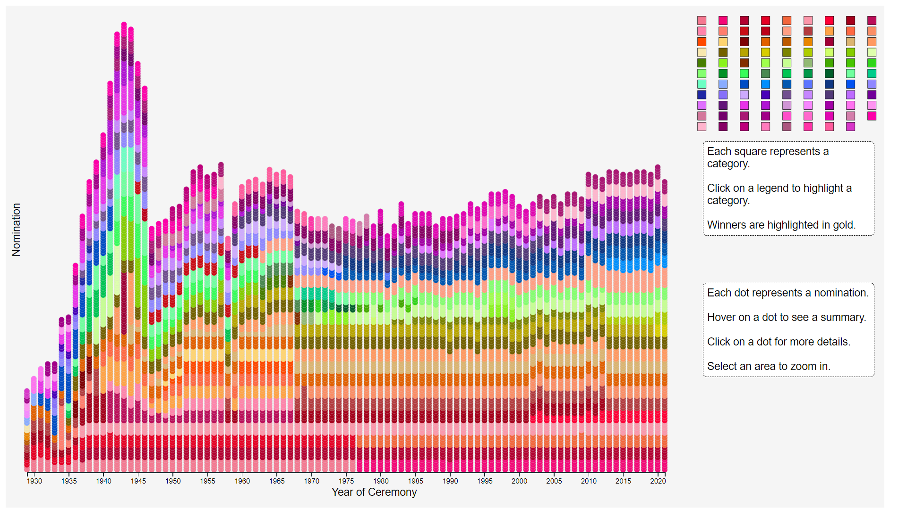
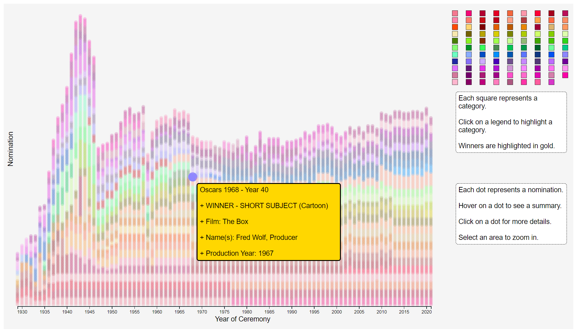
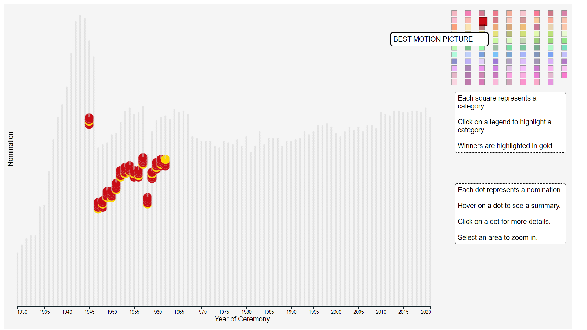
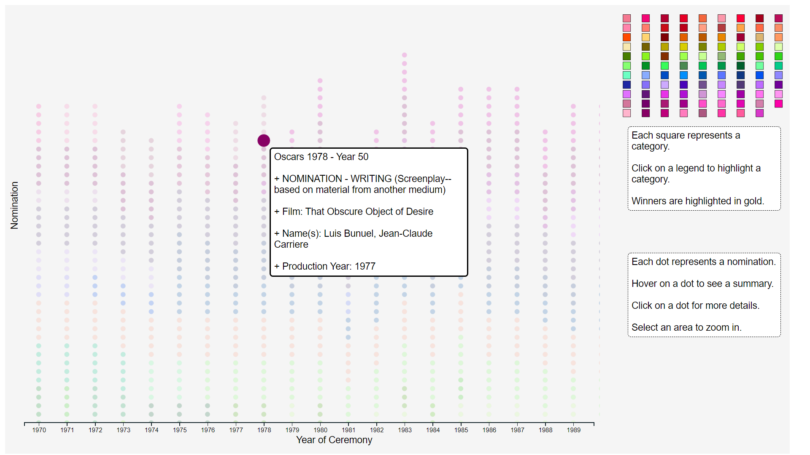
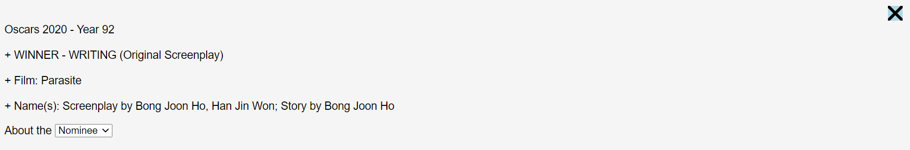
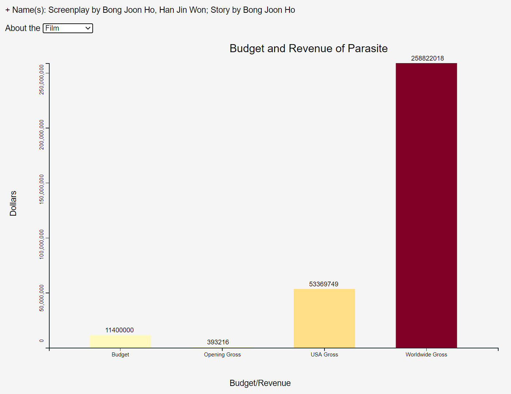
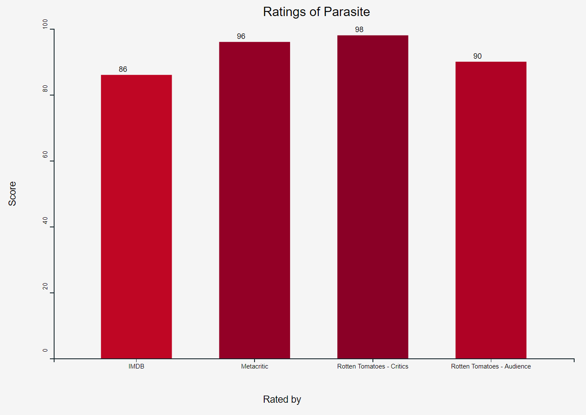
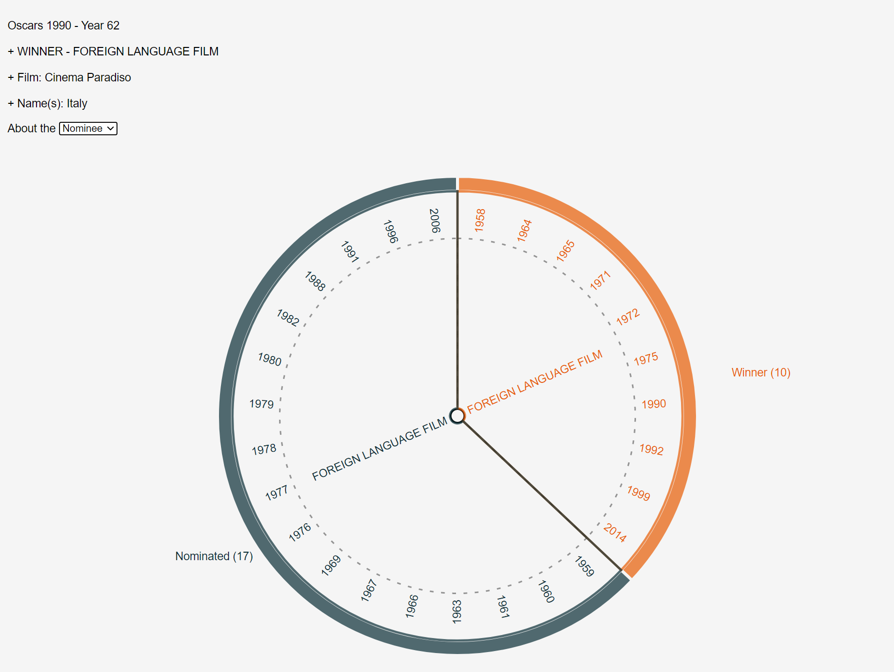

# A project in Data Science and Data Visualization
[Link to report.](shorturl.at/oGHW8)

* ##__Introduction__

It has always been widely acknowledged that prestigious film awards were only handed to the most worthy. A large portion of the audience is better at predicting a movie’s success than, sometimes, film experts. These bewildering but accurate assumptions turned out to be the actual results, which were solely based on the movie’s performance in theaters, specifically its impacts on social media, and the lasting impressions it was able to make. Contrary to popular belief, those listed above are not entirely how awards nominations and winners were chosen. Factors such as movie budget and profit, film scores through reviews via trusted sites created by experts such as IMDB, Rotten Tomatoes,... and other credible numbers are also crucial to decide a movie's worthiness. This project proposes the importance of figures and statistics, in addition to movie critics, contributing to movie successes and what the most renowned awards and nominations are based on. 

The data was collected from multiple sources. Using the database made by Unanimad on Kaggle, we added missing records from the Oscars’ Database. Ratings and revenue numbers were gathered from IMDB, Metacritic, and Rotten Tomatoes for the award shows in the most recent 30 years. The work was divided among the members and combined at the end of the collecting process.

* ##__Features__

The viewer is first presented with a chart showing the nominations in all categories from 1929 to 2021.

+ A nomination is represented by a dot, and a category by a square.

+ Hovering the mouse over a dot results in a pop-up box that provides information about that nomination.

+ Clicking on a legend, the dots associated with that category will be highlighted, and those that don't have the same category will be transparent.
+ Gold dots represent winners in each category when highlighted.

+ Brush magnifies each dot to make selecting easier.

Clicking on a dot draws up a layer on top of the previous chart, where the viewer can choose to view more about the film or the person or group of people nominated. The X button in the top right corner can be used to exit out of the layer.

Choosing the option “Film”, the viewer can see two bar charts.

+ The first chart shows the budget and three categories of gross: opening weekend, in the USA, and worldwide.

+ The second chart shows the ratings the movie received on websites such as IMDB, Metacritic, and Rotten Tomatoes.
+ The ratings are on a scale from 0 to 100.

The “Nominee” option shows a pie chart summarizing the nominee’s wins and nominations.

+ The inner radius shows the categories.
+ The outer radius shows the year the nomination was in.
+ The wins are in orange, other nominations in dark blue.

* ##__References__

https://www.kaggle.com/unanimad/the-oscar-award/

http://awardsdatabase.oscars.org/

https://www.imdb.com/

https://www.rottentomatoes.com/

https://www.metacritic.com/

